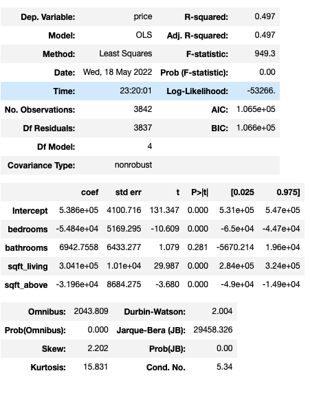
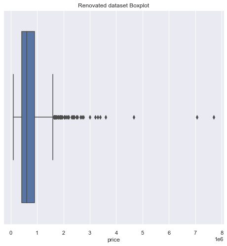
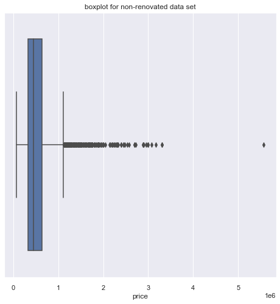
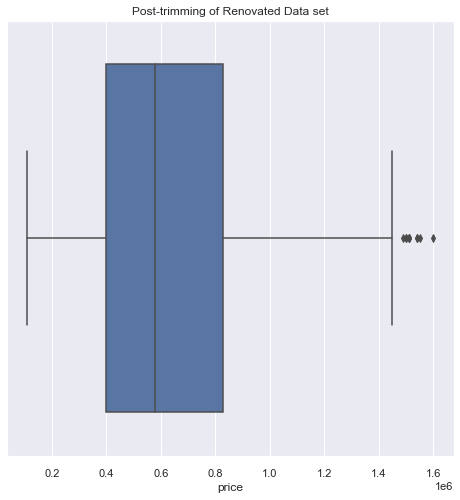
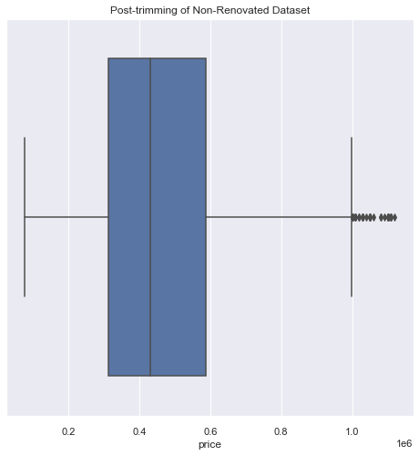
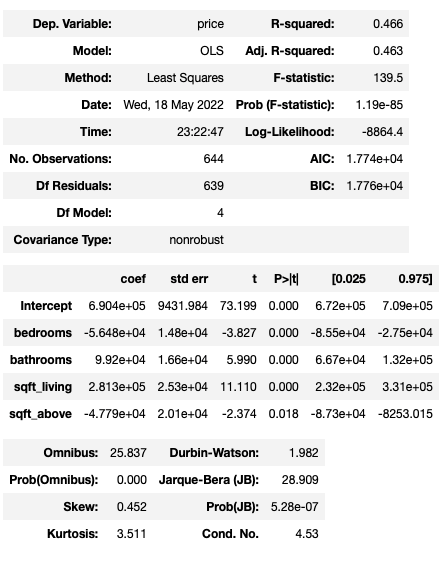
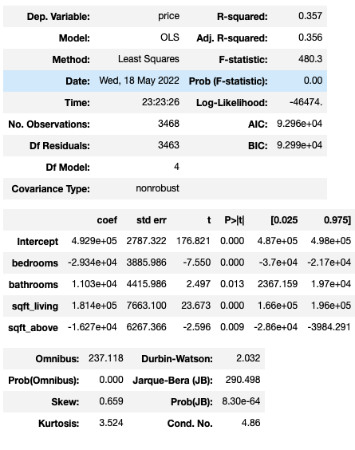

# To Renovate or not to renovate

## Background
Every Year, Americans renovate their home so when it comes time to sell, they can get best return. I create two multiple linear regression models based on whether they were renovated or not.

## Business Problem
How much does renovating or not renovating your home affect pricing of the home? By creating a multiple linear regression we can see how each coefficient works with pricing. From this we can create an actual formula that can be used to calculate how much your home will sell for once renovated or not renovated

## Data
Using KC data set. The data set is seperated  by renovated and then normalization data processing is done.
Renovated data set has 744 rows
Non renovated data set has 3842 rows.
Both have 5 rows

## Methods
First we sepearte data sets by whether they were renovated or not.
Data Processing occurs
Perform Multiple Linear Regression identify coefficients
Data trimmed to remove unnecessary outliers
Post-trimming Update Formula

## Results
After running the Multiple linear regression model, first thing we notice is that bedrooms and square footage apart from basement have a negative correlation on price, after renovations We can see apart of number of bedrooms, and square foot above, there is a greater impact on price when it comes to bathrooms and square foot of living area. The negative values in bedrooms and squarefoot above area indicates as price increases, they share negative correlation (”as one goes up the other goes down”).

To see outliers use what’s known as boxplots, where everything outside of the lines and boxes, are considered outliers. They affect our model because they are considered abnormal values.

Post model evaluation, we see that some coefficients are not really relevant. The most possible cause is due to outliers (or abnormal values).
One fix is the removal of outliers. Well, how many outliers are there in the data set? Well let’s look...

To see outliers use what’s known as boxplots, where everything outside of the lines and boxes, are considered outliers. They affect our model because they are considered abnormal values.

This is what removal of outliers looks like

Post Trimming the new shape for the renovated data set is 644 rows (down from 744), 5 columns.
Post trimming new shape for non-renovated data set is 3648 rows (down from 3842), 5 columns.

## Conclusions
After modeling the multiple linear regression model. We see both negative coefficients (areas renovated and areas not renovated). While both do share negative coefficients with bedrooms and square footage apart from basement. In the renovated data set, the positive coefficients (bathrooms and square footage of living area), quickly negate the negative affects and greatly impact price in comparison on non-renovated houses.

## Next Steps 

1) Evaluate renovated homes by decade renovated
2) Evaluate homes based on what year they were built (by decade built) and comparing whether renovation is necessary.
3) Evaluate what other areas of home can greatly impact price for renovated and non-renovated homes (e.g., kitchen, garage, etc.)